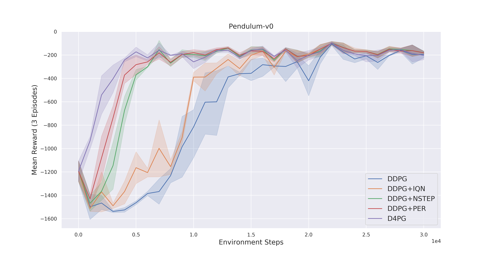
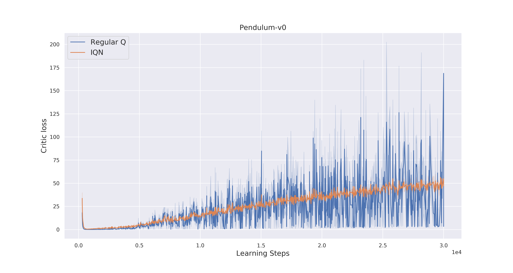
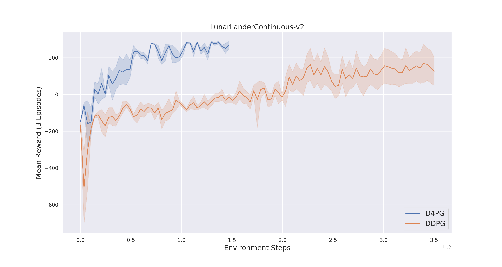

# PyTorch implementation of  D4PG 

This repository contains a PyTorch implementation of D4PG with IQN as the improved distributional Critic instead of C51. Also the extentions [Munchausen RL](https://arxiv.org/abs/2007.14430) and [D2RL](https://paperswithcode.com/paper/d2rl-deep-dense-architectures-in-1) are added and can be combined with D4PG as needed. 
  

#### Dependencies
Trained and tested on:
<pre>
Python 3.6
PyTorch 1.4.0  
Numpy 1.15.2 
gym 0.10.11 
</pre>

## How to use:
The new script combines all extensions and the add-ons can be simply added by setting the corresponding flags.

`python run.py -info your_run_info`

**Parameter:**
To see the options:
`python run.py -h`

### Observe training results
  `tensorboard --logdir=runs`

Added Extensions:

- Prioritized Experience Replay [X]
- N-Step Bootstrapping [X]
- D2RL [X]
- Distributional IQN Critic [X]
- Munchausen RL [X]
- Parallel-Environments [X]

## Results 
### Environment: Pendulum

Below you can see how IQN reduced the variance of the Critic loss:

### Environment: LunarLander

Notes:

- Performance depends a lot on good hyperparameter->> tau for Per bigger (pendulum 1e-2) for regular replay (1e-3)

- BatchNorm had good impact on the overall performance (!)
